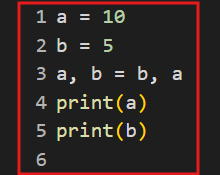
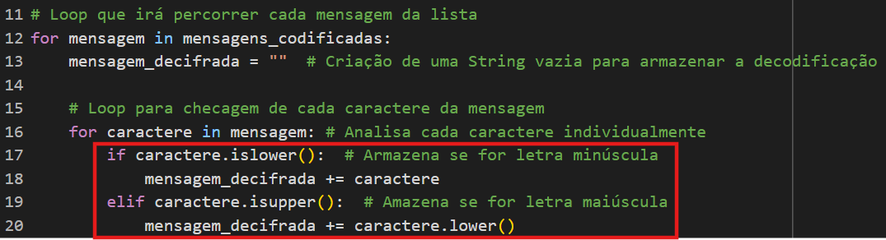
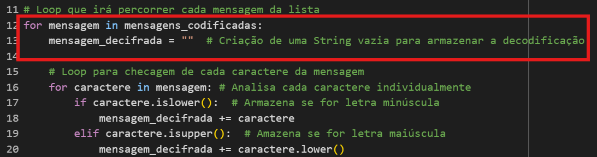

# Atividade 12/05/2025
## Estudo dirigido, abordando as estruturas de controle de fluxo de execução, com base no cronograma da disciplina.

## Breve introdução  
Teste

# Seção 1 - Estrutura Sequencial

Utilizou-se como base o exercício elaborado na aula do dia 17/03/2025.

# Seção 2 - Estrutura de Decisão

Utilizou-se como base o exercício elaborado na aula do dia 14/04/2025.

# Seção 3 - Estrutura de Repetição

Utilizou-se como base o exercício elaborado na aula do dia 14/04/2025.

