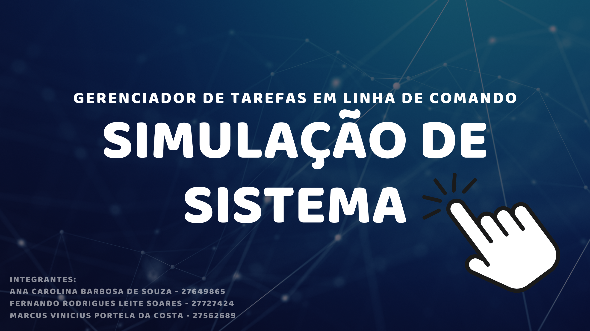

# 📝 Gerenciador de Tarefas em Linha de Comando

Um sistema simples e eficaz para organizar suas tarefas diárias diretamente do terminal.

---

## 💡 Valor do Projeto

Este projeto nasceu da necessidade comum de **organizar tarefas** e manter o controle de compromissos em um mundo cada vez mais acelerado.

O Gerenciador de Tarefas em Linha de Comando oferece uma **solução minimalista e direta**, focada nas funcionalidades essenciais de adicionar, visualizar, marcar como concluída e remover tarefas. Isso permite que o usuário gerencie suas atividades de forma ágil.

Do ponto de vista da disciplina de **Programação de Computadores**, este projeto é um excelente exemplo de aplicação prática dos seguintes conceitos:

* **Lógica de Programação e Algoritmos:** A base de todas as operações, desde a validação de entradas até a priorização de tarefas.
* **Estruturas Condicionais (`if`, `elif`, `else`):** Utilizadas para controlar o fluxo do programa, como a navegação no menu e a validação de dados.
* **Laços de Repetição (`while`, `for`):** Essenciais para manter o menu ativo, iterar sobre a lista de tarefas e processar múltiplas entradas.
* **Estruturas de Dados (`list`, `dict`):** Uma lista é usada como um "vetor" para armazenar os dicionários de tarefas, que por sua vez, representam a "estrutura" de cada tarefa (descrição, status, prioridade).
* **Programação Modular (Funções):** O código é dividido em funções claras e reutilizáveis (`adicionar_tarefa`, `visualizar_tarefas`, etc.), promovendo a organização e a manutenção.
* **Depuração e Testes:** Acompanhamento do código e criação de testes unitários para garantir a robustez e a correção das funcionalidades.
* **Controle de Versão (Git/GitHub):** Plataforma para colaboração, rastreamento de mudanças e documentação do projeto.

---

## 🛠️ Ferramentas

* **Linguagem de Programação:** Python 3.x
* **Ferramentas de Teste:** `unittest` (módulo padrão do Python)
* **Controle de Versão:** Git e GitHub
* **Ambiente de Desenvolvimento:** Recomenda-se o uso de um IDE como [VS Code](https://code.visualstudio.com/) ou [PyCharm](https://www.jetbrains.com/pycharm/) para facilitar a depuração.

---

## 👥 Equipe

Este projeto foi desenvolvido por:

* **Ana Carolina Barbosa de Souza - 27649865** - Desenvolvimento, análise de códigos e atualização de readme.
* **Fernando Rodrigues Leite Soares - 27727424** - Desenvolvimento e testes.
* **Marcus Vinicius Portela da Costa - 27562689** - Desenvolvimento e testes.

---

## 📽️ Simulação do sistema

<a href="https://drive.google.com/file/d/1DQ3-LJ5C_BU6OdRESrUM3NKWhb3uT1lx/view?usp=sharing">
  
</a>

Você também pode clonar este repositório e rodar o arquivo `tarefas.py` em seu terminal.

```bash
# Clone o repositório
git clone [URL_DO_SEU_REPOSITORIO]

# Navegue até o diretório do projeto
cd [nome-do-seu-repositorio]

# Execute o programa
python tarefas.py
